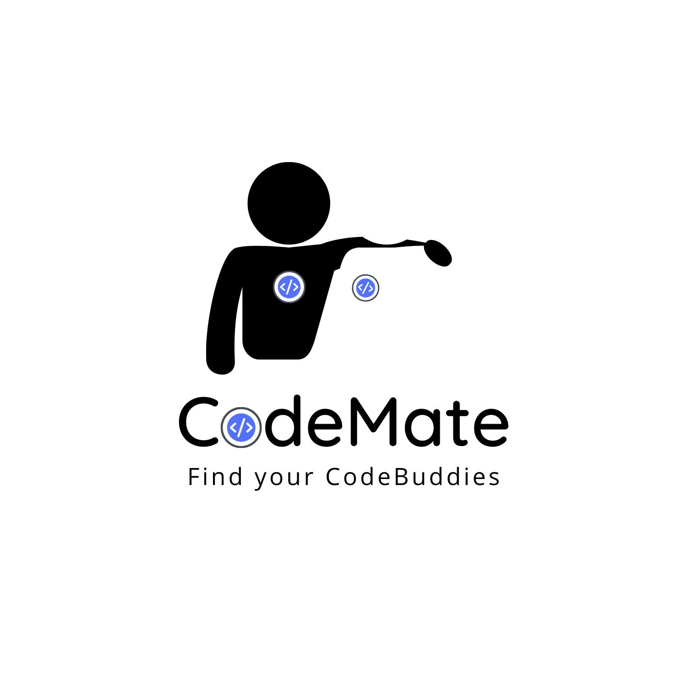

<h1 align="center"> Codemate - by Team SystemZombies </h1>

## About Codemate

Why Codemate:

- Suggesting Projects for Collaboration
- Suggesting Users for Collaboration
- Research Collaborations

Often, we find it difficult to find collaborators for our projects. Our Platform ‘CodeMate’ provides solutions to this problem.
Our Webapp Understands the Tech Stack of the users, Understands the Commit Style of the users and Suggests them projects for collaboration. 
Our project also compares Tech Stack and Flow of Work of users to recommends people for collaboration.
Research Area has not been so popular in india but Recently people have started giving it importance. We do not have a platform which can connect two enthusiastic researchers. We have tried to solve this big problem.

## Highlighting Features

- Collaborators for projects or People for discussion can be found in an efficient way.
- Our project will connect people who are enthusiastic in research, hence it will promote Research.